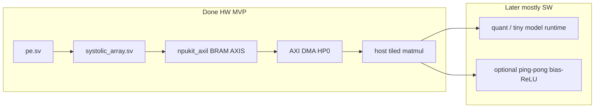

# FPGA NPU kickoff (8×8 int8 systolic)

## Goal

Start a **small NPU** on PYNQ-Z2: an **8×8 int8 systolic array**, built and verified the same way as blinker (SV modules + Icarus TBs on the host; Vivado `.bit`; load via Overlay / `Bitstream.download()`).

## Assumed MVP (default) — hardware done

1. **`pe` module** — int8 × int8 → accumulate (int32), with clear / enable; DSP48-preferred MAC
2. **`systolic_array`** — 8×8 PE grid, **output-stationary** (A west→east, B north→south)
3. **Testbenches** for `pe`, the array, and the AXI-Lite host path
4. **Project skeleton** with AXI-Lite + AXI DMA (PS `M_AXI_GP0` + `S_AXI_HP0`)
5. **Host** — tiled matmul via `host/npukit_matmul.py` / `.ipynb` (NumPy check)

The **hardware MVP is complete**. Remaining value is mostly **runtime**: quantization, packing, layer orchestration, and a tiny end-to-end model that calls the GEMM.

**Optional later (HW polish, not blockers):** ping-pong / larger on-chip tiles, fused bias+ReLU after GEMM, AXIS stimulus in `npukit_axil_tb`. No dedicated 3×3 / depthwise unit unless a DS-CNN target profiles that way.

## Project layout

- `rtl/pe.sv`, `rtl/systolic_array.sv`, `rtl/npukit_axil.sv`, `rtl/npukit_top.sv`, `rtl/npukit_pl.v`
- `sim/pe_tb.sv`, `sim/systolic_array_tb.sv`, `sim/npukit_axil_tb.sv`
- `host/npukit_matmul.py`, `host/npukit_matmul.ipynb`
- `scripts/create_project.tcl`, `scripts/build_bitstream.tcl`, `scripts/pynq_bitstream.tcl`

## Keep from blinker lessons

- SystemVerilog for design; `.v` wrapper only for BD
- Load with Overlay (DMA for A/B/C tiles) plus AXI-Lite MMIO for CTRL/STATUS (base `0x43C00000`); keep both paths
- Host: `npukit_matmul.py` is the source of truth; `.ipynb` is the interactive wrapper (classic 8×8 + tiled suites)
- Keep PS + board preset in the Vivado BD
- Module TBs before board bring-up

## Runtime vs fabric (for a real NN)

| On A9 / runtime first | Optional later in PL |
|-----------------------|----------------------|
| Orchestration, buffers, tiling | Fused bias + ReLU after GEMM |
| Reshape / transpose / `im2col` | Ping-pong A/B tiles |
| Quantize / dequantize / scales | Depthwise / pooling if CNN-hot |
| Softmax / argmax, pooling | — |

An int8 8×8 GEMM covers MLP/FC and 1×1 conv; standard conv can be lowered to GEMM in software. “1×1” means no spatial neighborhood — not identity and not all-ones weights.

## Status

MVP through DMA + host tiling is **done** (sim PASS; board **12/12 PASS** with Overlay/`axi_dma_0`, including tiled 16×16 and 32×32×32). Saved verbose dumps live in `host/npukit_matmul.ipynb`. Rebuild with `../scripts/build_bitstream.sh npukit` (or in-repo `scripts/`) after RTL/BD changes.

### Z7020 size note (8×8 + DMA measured; 16×16 not built)

Placed util for the current DMA bitstream: **~13% LUT, ~9% FF, 64 DSP (29%), 2 BRAM tiles**  
(roughly **87% LUT / 91% FF / 71% DSP / 99% BRAM** still free).

Those **2 BRAM tiles** are Vivado’s packing of the three small logical memories (`a_mem`, `b_mem`, `c_mem` — one 8×8 tile each). They are **not** ping-pong buffers and **not** two concurrent matrix slots. Larger MxKxN products are tiled in software over the single A/B/C tile buffers.

Scaling the PE grid \(8→16\) is still \(4×\) array area (~256 DSPs needed for 1:1 MAC mapping; the chip has 220), so prefer **stay 8×8 + tile + DMA**, optionally add ping-pong later to overlap load and compute.
