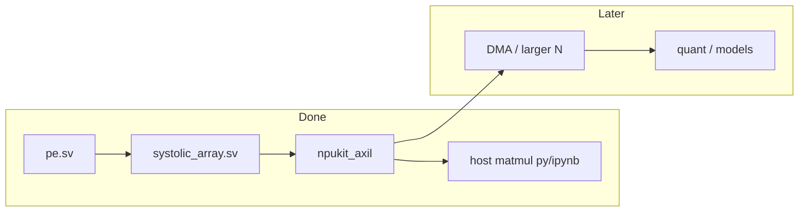

# FPGA NPU kickoff (8×8 int8 systolic)

## Goal

Start a **small NPU** on PYNQ-Z2: an **8×8 int8 systolic array**, built and verified the same way as blinker (SV modules + Icarus TBs on the host; Vivado `.bit`; load via `Bitstream.download()`).

## Assumed MVP (default)

1. **`pe` module** — int8 × int8 → accumulate (int32), with clear / enable
2. **`systolic_array`** — 8×8 PE grid, **output-stationary** (A west→east, B north→south)
3. **Testbenches** for `pe`, the array, and the AXI-Lite host path
4. **Project skeleton** parallel to blinker, plus AXI-Lite on PS `M_AXI_GP0`
5. **Host** — `host/npukit_matmul.py` and `host/npukit_matmul.ipynb` (NumPy check)

**Next / later:** DRAM DMA, real NN models, quantization toolchain.

## Project layout

- `rtl/pe.sv`, `rtl/systolic_array.sv`, `rtl/npukit_axil.sv`, `rtl/npukit_top.sv`, `rtl/npukit_pl.v`
- `sim/pe_tb.sv`, `sim/systolic_array_tb.sv`, `sim/npukit_axil_tb.sv`
- `host/npukit_matmul.py`, `host/npukit_matmul.ipynb`
- `scripts/create_project.tcl`, `scripts/build_bitstream.tcl` (`project_name "npukit"`, `use_axi_lite 1`)
- Shared BD helper: `../scripts/pynq_bitstream.tcl`

## Keep from blinker lessons

- SystemVerilog for design; `.v` wrapper only for BD
- Load with `Bitstream` + `MMIO` (base `0x43C00000`)
- Keep PS + board preset in the Vivado BD
- Module TBs before board bring-up

## Status

Milestones 1–2 are **done** (sim + AXI-Lite + BD + PYNQ host, board PASS). Rebuild with `../scripts/build_bitstream.sh npukit` after RTL/BD changes.

### Z7020 size note (8×8 measured; 16×16 not built)

Placed util for current design (~14.7% LUT, ~6.4% FF, **0 DSP**, **0 BRAM**): multipliers are in LUTs. Scaling PEs \(8→16\) is \(4×\) array area → roughly **~55–65% LUT** if still LUT-MAC, before DMA. DSPs are free today — mapping int8 MACs to DSP48 would shrink LUT use a lot. Soft DMA (AXI DMA + interconnect/HP) is typically a few kLUT + some BRAM; tight but plausible on Z7020 if DSP-mapped or carefully floorplanned. Treat 16×16+DMA as **fit-with-care**, not free headroom.
