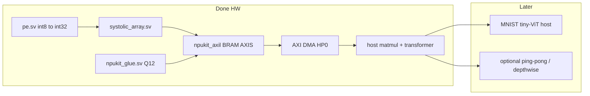

# FPGA NPU kickoff (8×8 int8 systolic)

## Goal

Start a **small NPU** on PYNQ-Z2: an **8×8 int8 systolic array**, built and verified the same way as blinker (SV modules + Icarus TBs on the host; Vivado `.bit`; load via Overlay / `Bitstream.download()`).

## Assumed MVP (default) — hardware done

1. **`pe` module** — int8 × int8 → accumulate (**int32**), with clear / enable; DSP48-preferred MAC
2. **`systolic_array`** — 8×8 PE grid, **output-stationary** (A west→east, B north→south)
3. **Testbenches** for `pe`, the array, and the AXI-Lite host path
4. **Project skeleton** with AXI-Lite + AXI DMA (PS `M_AXI_GP0` + `S_AXI_HP0`)
5. **Host** — tiled matmul via `host/npukit_matmul.py` / `.ipynb` (NumPy check)

The **GEMM hardware MVP is complete**. Transformer **glue** (VERSION `0x300`: residual / GELU / RMSNorm / Softmax, `MAX_LEN=16`) meets **100 MHz** and passes on PYNQ-Z2 with `host/npukit_transformer.py`. Synthetic 1-layer e2e smoke (T=8×D=8) is **ALL E2E PASS** in `host/npukit_transformer_e2e.ipynb`. RoPE / masks / reshape stay on the A9.

**WIP done for MVP path:** MNIST tiny-ViT at **T=16×D=16** (native 28×28, patch 7, pad 49→56) with QAT + shift aug on full 60k. Float ~93%, quantized ref ~90%, board **ALL VIT PASS**. **Optional later:** 2nd layer, ping-pong, depthwise, AXIS stimulus in `npukit_axil_tb`.

Docs: status [`docs/STATUS.md`](docs/STATUS.md), FPGA vs CPU [`docs/transformer_split.md`](docs/transformer_split.md), glue contract [`docs/transformer_glue.md`](docs/transformer_glue.md), bring-up [`docs/glue_bringup.md`](docs/glue_bringup.md), tiling [`docs/tiling.md`](docs/tiling.md).

## Project layout

- `rtl/pe.sv`, `rtl/systolic_array.sv`, `rtl/npukit_glue.sv`, `rtl/npukit_axil.sv`, `rtl/npukit_top.sv`, `rtl/npukit_pl.v`
- `sim/pe_tb.sv`, `sim/systolic_array_tb.sv`, `sim/npukit_axil_tb.sv`, `sim/npukit_glue_tb.sv`
- `host/npukit_matmul.py`, `host/npukit_matmul.ipynb`, `host/npukit_transformer.py`, `host/npukit_transformer_e2e.ipynb`
- `docs/STATUS.md`, `docs/tiling.md`, `docs/transformer_split.md`, `docs/transformer_glue.md`, `docs/glue_bringup.md`
- `scripts/create_project.tcl`, `scripts/build_bitstream.tcl`, `scripts/pynq_bitstream.tcl`

## Keep from blinker lessons

- SystemVerilog for design; `.v` wrapper only for BD
- Load with Overlay (DMA for A/B/C tiles) plus AXI-Lite MMIO for CTRL/STATUS (base `0x43C00000`); keep both paths
- Host: `npukit_matmul.py` / `npukit_transformer.py` are source of truth; `.ipynb` is interactive
- Keep PS + board preset in the Vivado BD
- Module TBs before board bring-up
- Force clean OOC resynth after PL RTL edits (see `docs/glue_bringup.md`)

## Runtime vs fabric

| On A9 / runtime | In PL today |
|-----------------|-------------|
| Orchestration, buffers, tiling | 8×8 int8 GEMM + int32 C |
| Reshape / transpose / `im2col` | Residual, GELU, RMSNorm, Softmax (len≤16) |
| Quantize / dequantize / scales | |
| RoPE, attention masks | |
| Vectors longer than glue `MAX_LEN` | |

**Widths:** host MMIO is always **32-bit**. GEMM accumulators are int32. Glue banks are int32 Q12/Q16. Wide `[63:0]` signals in glue are **internal mul/div widenings** only — not a 64-bit MCU interface. See [`docs/glue_bringup.md`](docs/glue_bringup.md).

An int8 8×8 GEMM covers MLP/FC and 1×1 conv; standard conv can be lowered to GEMM in software. “1×1” means no spatial neighborhood — not identity and not all-ones weights.

## Status

- GEMM + DMA + host tiling: **done** (board **12/12 PASS**; dumps in `host/npukit_matmul.ipynb`).
- Transformer glue v0x300: **done** (100 MHz closed; board residual/GELU/RMSNorm/Softmax + GEMM PASS).
- Synthetic 1-layer e2e T=8×D=8: **done** (**ALL E2E PASS** in `host/npukit_transformer_e2e.ipynb`).
- Next: MNIST tiny-ViT host path (see [`docs/STATUS.md`](docs/STATUS.md)).
- Rebuild with `../scripts/build_bitstream.sh npukit` (or in-repo `scripts/`) after RTL/BD changes.

### Z7020 size note

GEMM-only bit was ~**13% LUT / 64 DSP**; with glue ~**18–19% LUT / ~72 DSP**. Those **2 BRAM tiles** on the GEMM path are packing of `a_mem`/`b_mem`/`c_mem` — not ping-pong. Glue vector banks are small register files (`MAX_LEN=16`).

Scaling the PE grid \(8→16\) is still \(4×\) array area (~256 DSPs needed for 1:1 MAC mapping; the chip has 220), so prefer **stay 8×8 + tile + DMA**, optionally add ping-pong later.
