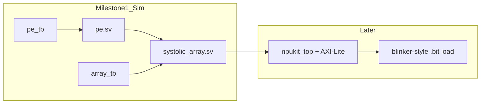

# FPGA NPU kickoff (8×8 int8 systolic)

## Goal

Start a **small NPU** on PYNQ-Z2: an **8×8 int8 systolic array**, built and verified the same way as blinker (SV modules + Icarus TBs on the host; Vivado `.bit` later; load via `Bitstream.download()`).

## Assumed MVP (default)

Unless you redirect this, the first milestone is:

1. **`pe` module** — int8 × int8 → accumulate (e.g. int32), with clear enable/clear
2. **`systolic_array_8x8`** — 8×8 PE grid, weight-stationary or output-stationary (pick one and stick to it; default: **output-stationary** MAC array with simple neighbor shift of activations/partials)
3. **Testbenches** for `pe` and the array (known matrices; check results in sim)
4. **Project skeleton** parallel to blinker: `rtl/`, `sim/`, `constraints/`, `scripts/`, BD `.v` wrapper, PS board preset via `../scripts/pynq_bitstream.tcl`

**Deferred to later milestones** (not in first cut): AXI-Lite host regs, DRAM DMA, real NN models, quantization toolchain. First win = **correct matmul in simulation**.

## Project layout

Create `/home/user/fpga/npukit/` using the shared flow:

- `rtl/pe.sv`, `rtl/systolic_array.sv`, `rtl/npukit_top.sv`, `rtl/npukit_pl.v` (BD wrapper)
- `sim/pe_tb.sv`, `sim/systolic_array_tb.sv`
- `scripts/create_project.tcl`, `scripts/build_bitstream.tcl` pointing at `project_name "npukit"`
- Start constraints from blinker pins; NPU I/O will grow when host interface is added

## Implementation order

1. Scaffold project + empty tops/wrapper wired like blinker (clock/reset/LED optional heartbeat)
2. Implement and sim **`pe`**
3. Implement and sim **`8×8` array** with a tiny fixed test (e.g. 8×8 × 8×8 int8 → int32)
4. Only after green TBs: hook into BD/bitstream path (may still only blink or expose status LEDs until AXI is added)

## Keep from blinker lessons

- SystemVerilog for design; `.v` wrapper only for BD
- No Overlay/`.hwh`; load with `Bitstream`
- Keep PS + board preset in the Vivado BD
- Module TBs before board bring-up

## Status

All MVP milestone-1 items above are **completed** (as of the initial NpuKit commit).
