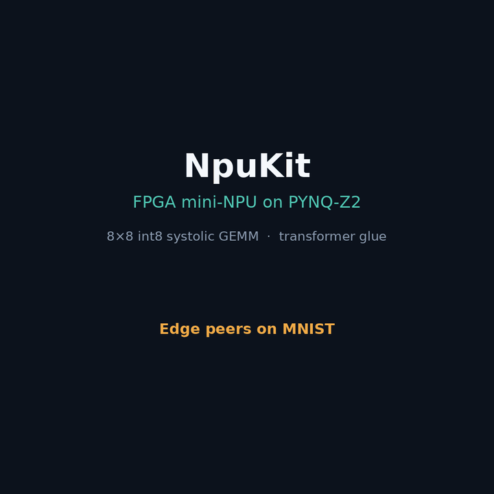

# NpuKit

FPGA mini-NPU for the [PYNQ-Z2](https://www.tulembedded.com/FPGA/ProductsPYNQ-Z2.html) (Xilinx **Zynq-7020**): an **8×8 int8** output-stationary **systolic GEMM** (AXI4-Lite + AXI DMA) plus **transformer glue** (residual / GELU / RMSNorm / Softmax, `MAX_LEN=16`, 100 MHz). The Zynq A9 host tiles matmuls, runs a tiny **DS-stem** + float Softmax/RMSNorm/GELU, and schedules deploy-quantized **tiny-ViT** blocks (int8 GEMM on PL) on MNIST (~**98.0%**); a host **MCU-class DS-CNN** peer (~**98%** int8) sits beside it for edge compare.

Part of [NetKit Labs](https://github.com/NetKit-Labs) — companion to [netkit](https://github.com/NetKit-Labs/netkit) (MCU/MPU inference), focused here on **custom FPGA acceleration** for edge transformers.

**Keywords:** FPGA · PYNQ-Z2 · Zynq-7020 · systolic array · int8 GEMM · NPU · AXI DMA · transformer · ViT · MNIST · TinyML · QAT · DS-CNN · edge AI

## Where we are

| Done | Item |
|:---:|---|
| yes | `pe` — int8 × int8 → int32 MAC, with clear / enable and A/B forward |
| yes | `systolic_array` — 8×8 PE grid (A west→east, B north→south, C stationary) |
| yes | Icarus testbenches: `pe_tb`, `systolic_array_tb`, `npukit_axil_tb` |
| yes | BRAM-backed A/B/C tile storage, DSP-preferred PE MACs |
| yes | AXI4-Lite control + AXI-Stream tile ports; Vivado BD adds AXI DMA via PS HP0 |
| yes | Board face: LD0 heartbeat, LD1 busy, LD2 done; BTN0 = reset hold |
| yes | Python host on PYNQ: `npukit_matmul.py` + notebook wrapper (classic 8×8 + tiled suites) |
| yes | Board bring-up verified on PYNQ-Z2 (DMA + AXI-Lite control, **12/12 PASS**) |
| yes | Keep both paths: DMA for matrix tiles, MMIO/AXI-Lite for control (+ fallback) |
| yes | Saved notebook run: classic 8×8 + tiled 16×16 / 32×32 dumps in `npukit_matmul.ipynb` |
| yes | **Hardware MVP complete** (GEMM) |
| yes | Transformer glue (`rtl/npukit_glue.sv`): residual / GELU / RMSNorm / Softmax — board PASS @ 100 MHz |
| yes | Host `host/npukit_transformer.py` + `.ipynb` (glue + GEMM); RoPE / mask / reshape stay on A9 |
| yes | E2E 1-layer smoke T=8×D=8 + fixed scales — `host/npukit_transformer_e2e.ipynb` (**ALL E2E PASS**) |
| yes | MNIST tiny-ViT: richer CPU DS-stem (MID=24) + T=16×D=16×MLP32×L=4, per-channel weights, A9 float norms, int8 GEMM (~**98.0%** numpy/full test) |
| yes | Host MCU-class DS-CNN MNIST peer (int8 ~**98.4%** / ~8 KiB; vs MCU+NpuKit tiny-ViT ~**98.0%** / ~13 KiB) |
| yes | Full board smoke with new weights: `host/npukit_board_smoke.ipynb` — **ALL SMOKE PASS**; ViT n=64 ref/hw **96.9%**, agree **100%** |

Status write-up (results + next path): **[`docs/STATUS.md`](docs/STATUS.md)**.

## Edge peers (MCU vs MCU+accelerator)

Same MNIST task, two **deployment-shaped** models — not a param-matched bake-off:

| Peer | Role | Headline |
|------|------|----------|
| **DS-CNN** (`host/dscnn_mnist*.py`) | TinyML CNN you’d run on a Cortex-M / TFLite Micro–class MCU | int8 **~98.4%** / ~**8.3 KiB** (host; not on FPGA) |
| **Tiny-ViT** (`host/npukit_vit_mnist*.py`) | CPU DS-stem + FPGA int8 GEMM + A9 float Softmax/RMSNorm/GELU | deploy-quant **~98.0%** / ~**13 KiB** (board **ALL SMOKE PASS** / **ALL VIT PASS** with MID=24 stem) |

Compare **accuracy + weight KiB + where compute runs**. Details: [`docs/STATUS.md`](docs/STATUS.md).



Animated story (`python3 viz/edge_peers_anim.py` → `viz/out/edge_peers.gif`). LinkedIn tip: native video is sharper if you re-export; the GIF is feed-friendly.

## 5-minute board bring-up

Goal: load the bit and get **ALL SMOKE PASS** (matmul → glue → e2e → ViT).

1. **Copy once** (after a bitstream rebuild):

```bash
scp output/npukit.bit output/npukit.hwh \
  host/board_bringup_5min.sh host/npukit_board_smoke.py host/npukit_board_smoke.ipynb \
  host/npukit_matmul.py host/npukit_transformer.py host/npukit_vit_mnist.py \
  host/vit_mnist_weights.npz host/mnist_sample.npz \
  xilinx@<pynq>:jupyter_notebooks/
```

2. **On the PYNQ** (sudo + XRT/venv):

```bash
# CLI
bash board_bringup_5min.sh
# or:
python3 npukit_board_smoke.py /home/xilinx/jupyter_notebooks/npukit.bit --vit-n 64
```

3. **Saved dumps (preferred for git):** open [`host/npukit_board_smoke.ipynb`](host/npukit_board_smoke.ipynb) → **Run All** → **Save**.

From a laptop with `sshpass`: `BOARD=xilinx@192.168.0.215 ./host/board_bringup_5min.sh`.

## Hierarchy

```
npukit_pl.v                 BD wrapper (AXI4-Lite + AXIS + btn/led)
└── npukit_top.sv           heartbeat + reset combine
    └── npukit_axil.sv      regs, BRAM A/B/C, AXIS, GEMM sequencer
        ├── systolic_array.sv
        │   └── pe.sv × 64     (DSP48E1 MAC)
        └── npukit_glue.sv     residual / GELU / RMSNorm / Softmax
```

Placed utilization (Zynq-7020): GEMM-only DMA bit was **~13% LUT / 64 DSP**; with transformer glue
**~18–19% LUT / ~72 DSP**. Plenty of headroom; DSPs remain the main limit if the PE grid grows.

## AXI-Lite register map

Base address (BD default target): **`0x43C0_0000`**

| Offset | Name | Access | Description |
|--------|------|--------|-------------|
| `0x000` | ID | R | `0x4E50554B` (`NPUK`) |
| `0x004` | VERSION | R | `0x00000300` (glue-enabled bitstreams) |
| `0x008` | STATUS | R | `[0]` busy, `[1]` gemm done, `[2]` AXIS RX, `[3]` AXIS TX, `[4]` glue done |
| `0x00C` | CTRL | W | `[0]` start, `[1]` clear, `[2]` arm C AXIS TX (all write-1 pulses) |
| `0x010` | N | R | `8` |
| `0x014` | FEATURES | R | `[0]` GEMM, `[1]` GLUE |
| `0x018` | GLUE_CTRL | W | `[0]` start, `[7:4]` opcode — see `docs/transformer_glue.md` |
| `0x01C` | GLUE_LEN | R/W | vector length `1..16` |
| `0x020` | GLUE_PARAM | R/W | e.g. RMSNorm ε (Q12) |
| `0x024` | GLUE_COUNT | R | increments each completed glue op (preferred host sync) |
| `0x100`–`0x13F` | A | R/W | 64× int8 packed as 16× `uint32` (LE), row-major |
| `0x200`–`0x23F` | B | R/W | same packing |
| `0x400`–`0x4FF` | C | R | 64× int32, row-major |
| `0x500`–`0x8FF` | GLUE banks | R/W | X / Y / OUT / GAMMA (**int32** Q12; Softmax OUT Q16), len ≤ 16 |

AXIS packets are 16 packed `uint32` A words then 16 B words, with `TLAST` on word 32; C returns 64 `int32` words after `CTRL.tx_arm`. For a K-tiled result, issue `CTRL=3` for the first tile and `CTRL=1` thereafter; `start` alone preserves the PE accumulators.

## Simulate (host)

```bash
cd npukit

iverilog -g2012 -o sim/pe_tb.vvp rtl/pe.sv sim/pe_tb.sv && vvp sim/pe_tb.vvp

iverilog -g2012 -o sim/array_tb.vvp rtl/pe.sv rtl/systolic_array.sv sim/systolic_array_tb.sv
vvp sim/array_tb.vvp

iverilog -g2012 -o sim/npukit_axil_tb.vvp \
  rtl/pe.sv rtl/systolic_array.sv rtl/npukit_axil.sv sim/npukit_axil_tb.sv
vvp sim/npukit_axil_tb.vvp
```

Expect `ALL PASS` from each TB.

## Build / load (board)

```bash
# From fpga/ monorepo (sources Vivado if needed):
../scripts/build_bitstream.sh npukit
# → output/npukit.bit and output/npukit.hwh
```

Or manually:

```bash
vivado -mode batch -source scripts/create_project.tcl   # once / after RTL port changes
vivado -mode batch -source scripts/build_bitstream.tcl
```

Copy to the PYNQ and run the host check:

```bash
scp output/npukit.bit output/npukit.hwh host/npukit_matmul.py host/npukit_matmul.ipynb \
  xilinx@<pynq>:jupyter_notebooks/
```

**CLI** (use the PYNQ venv; `/dev/fpga0` may require `sudo`):

```bash
source /etc/profile.d/xrt_setup.sh
source /usr/local/share/pynq-venv/bin/activate
python /home/xilinx/jupyter_notebooks/npukit_matmul.py \
  /home/xilinx/jupyter_notebooks/npukit.bit 32 32 32
```

**Full board smoke** (matmul → glue → e2e → ViT in one shot):

```bash
python /home/xilinx/jupyter_notebooks/npukit_board_smoke.py \
  /home/xilinx/jupyter_notebooks/npukit.bit --vit-n 64
# or open npukit_board_smoke.ipynb, Run All, then save
```

**Jupyter:** open `npukit_matmul.ipynb` and run all cells. The notebook is an interactive wrapper around `npukit_matmul.py` (classic 8×8 suite + tiled MxKxN). Matrix data is always built in Python (e.g. `classic_8x8_cases()` / `tiled_cases()`), never loaded from the `.bit`. A checked-in board run on PYNQ-Z2 (DMA transport) shows **12/12 PASS**, including tiled **16×16** and **32×32×32**, with verbose A/B/C dumps left in the cell outputs.

**PS ↔ PL paths (keep both):**

| Path | Protocol / IP | Use |
|------|----------------|-----|
| MMIO | AXI4-Lite @ `0x43C0_0000` | CTRL / STATUS / ID; also A/B/C fallback if DMA unavailable |
| DMA | `axi_dma_0` @ `0x4040_0000` → AXIS | Bulk A/B tile in, C tile out |

With the matching `.hwh`, the host prefers Overlay + DMA for matrices and still uses AXI-Lite for control. Without `.hwh`, it falls back to AXI-Lite MMIO for everything. Keep `.bit` and `.hwh` side by side. The PL config is lost on power cycle; re-run the host to reload the `.bit`.

## Tiling math

How host tiling and the inner dimension $K$ work (with a 16×16 worked example): **[`docs/tiling.md`](docs/tiling.md)**.

The PYNQ host/`ipynb` print **A**, **B**, **C_npu**, **C_ref**, and a tiling plan for every case (pass `--quiet` on the CLI to suppress). After running the notebook, save it so those dumps stay in the file.

## Transformer glue

Common transformer epilogue ops (residual, GELU, RMSNorm, Softmax) are in fabric via **`rtl/npukit_glue.sv`** (`MAX_LEN=16`, 100 MHz closed). RoPE / masks / reshape stay on the A9.

- **FPGA vs CPU split:** **[`docs/transformer_split.md`](docs/transformer_split.md)**
- Contract + opcodes: **[`docs/transformer_glue.md`](docs/transformer_glue.md)**
- Bring-up history / bit-width notes: **[`docs/glue_bringup.md`](docs/glue_bringup.md)**

```bash
# Offline fixed-point reference (no board):
python3 host/npukit_transformer.py --ref-only

# On PYNQ (sudo + XRT/venv; bit at VERSION 0x300):
python3 host/npukit_transformer.py /home/xilinx/jupyter_notebooks/npukit.bit
```

Simulate glue: `iverilog -g2012 -o sim/npukit_glue_tb.vvp rtl/npukit_glue.sv sim/npukit_glue_tb.sv && vvp sim/npukit_glue_tb.vvp`

## Visualize

```bash
python3 viz/edge_peers_anim.py        # MCU DS-CNN vs tiny-ViT story → viz/out/edge_peers.gif
python3 viz/systolic_anim.py          # Pillow GIF → viz/out/systolic_8x8.gif
# or Manim (see viz/render_linkedin.sh)

# Netron graphs (https://netron.app — Open Model / drag-and-drop):
python3 host/export_netron.py         # → host/netron/*.onnx
#   dscnn_mnist_peer.onnx     MCU DS-CNN benchmark (CPU)
#   npukit_vit_system.onnx    CPU DS-stem + FPGA transformer + CPU head
```

## Layout

```
npukit/
  rtl/           pe, systolic_array, npukit_glue, npukit_axil, npukit_top, npukit_pl
  sim/           pe_tb, systolic_array_tb, npukit_axil_tb, npukit_glue_tb
  host/          matmul / transformer / e2e / vit_mnist / board_smoke / dscnn (+ train_*.py, weights)
  docs/          STATUS.md, tiling.md, transformer_glue.md, transformer_split.md, glue_bringup.md
  viz/           animation scripts
  constraints/   pynq_z2.xdc (btn/led; clock from PS FCLK0)
  scripts/       create_project.tcl, build_bitstream.tcl, pynq_bitstream.tcl
  output/        bitstream artifacts (gitignored)
```

## Design notes

- **Output-stationary:** each PE keeps its **int32** accumulator; A/B are **int8** streams.
- **Widths:** GEMM is int8→int32; glue MMIO banks are **int32** Q12/Q16 for a **32-bit** A9/MCU driver. Any `[63:0]` in glue RTL is an **internal mul/div widening** in fabric, not a 64-bit host ABI — see [`docs/glue_bringup.md`](docs/glue_bringup.md).
- PL fabric clock is **PS FCLK0 (100 MHz)**; AXI-Lite on **M_AXI_GP0**; DMA data on **S_AXI_HP0**.
- Host software runs on the **Zynq A9 / PYNQ Linux** (not on a laptop). It tiles MxKxN as 8×8 blocks and accumulates over K in the PE registers.
- **MMIO ≠ AXI-Lite:** AXI-Lite is the bus protocol; MMIO is the CPU mapping of those registers. We keep MMIO (control + fallback) and DMA (matrix payloads) together.
- **A/B/C memories:** three logical tile buffers (`a_mem` / `b_mem` / `c_mem`) — one 8×8 A tile, one 8×8 B tile, one 8×8 C result. Vivado may report **2 BRAM tiles** for packing; that is a utilization detail, not ping-pong or two matrix slots.
- **NN coverage:** an int8 GEMM is enough for MLP / FC and 1×1 conv; standard conv can use `im2col`→GEMM later. No dedicated 3×3 / depthwise engine for now.
- **Host vs PL:** DS-stem, RoPE/masks/pack, quant/scales, Softmax/RMSNorm/GELU (float deploy), and orchestration stay on the **A9**. Heavy **int8 GEMM** runs on PL. HW glue remains for unit/e2e tests. Optional later: fused bias+ReLU, ping-pong, depthwise on FPGA.
- **Sim:** `npukit_axil_tb` covers AXI-Lite (+ accumulate); `npukit_glue_tb` covers glue. Do not Icarus-sim the Xilinx DMA IP.
- BD helper: `scripts/pynq_bitstream.tcl` (`use_axi_lite=1`, `use_axi_dma=1`).

## License

MIT (see `LICENSE`).
